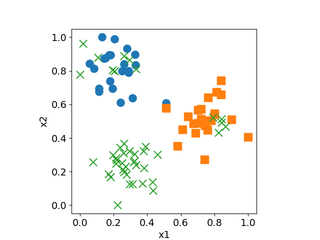

# Quantum-enhanced-K-means
The datasets below were used in Section 5 of the paper, "A quantum algorithm of K-means toward practical use" (Quantum Information Processing, Published online: 05 April 2022). 
- data-x.txt: the features of the synthetic dataset. 
- data-label.txt: the labels of the synthetic dataset. 
- image-name-list.txt: image file names.  

##### Version information
Ubuntu: 18.04.6 LTS 
Python: 3.8.5 
qiskit-terra: 0.15.2 
qiskit-aer: 0.6.1 
qiskit-ignis: 0.4.0 
qiskit-ibmq-provider: 0.9.0 
qiskit-aqua: 0.7.5 
qiskit: 0.21.0  

##### Sample program
q-kmeans.py  

##### Usage
$ python q-kmeans.py  

##### Result

